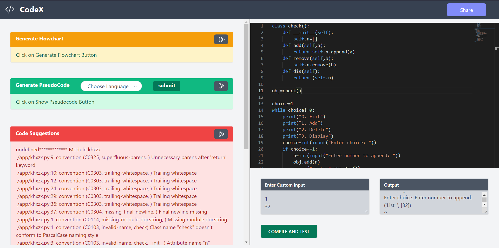
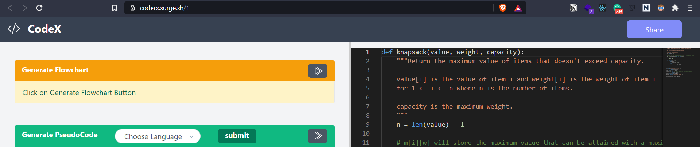

# CodeX

Link to deployed URL - [CodeX](http://coderx.surge.sh)

[CodeX](http://coderx.surge.sh) is a platform which converts code into easy to understand language.

## Project Description

Sometimes we write some code or we copy the code from some resource but we can’t interpret the working/logic behind the code. While writing the code when we get stuck in some problem, we directly redirect to stackoverflow or github but from there we don’t get in depth knowledge about the code.

To solve the particular problem we have build a website to interpret the complex code easily. Through this website, we are targeting to deliver comprehensive analysis of the code with the help of machine learning. With the help of machine learning we are planning to add automatic generation of pseudo code based on the user's input.

While writing code you will also get realtime recommendations to improve your code quality as per industry standards.

We are also providing the translation of pseudocode in 118 global languages, because people from non-english speaking countries find it difficult to understand the pseudocode in English, So we decided to extend our helping hand to them.

The automatic generated pseudo code will act as a blueprint and will help our users to understand the code better. Apart from this we have given flow chart generation which will help the user to comprehend the code better because visual things have much greater impact on human brain as compared to textual format.

You can share your code by clicking just a button. It will give a unique URL to your code to share it with your friends, colleagues or teachers.

Test and Compile feature is also available on this website, so that user can cross-check his / her output based on the input.

## Mockups

## Presentation
[PPT](https://docs.google.com/presentation/d/1R767ack-2fZx-W1FVFHRi0XrrJph0PCmLfz5FjJ0Zzk/edit?usp=sharing)

## Video

## Instructions

1. Clone the repository into your local system
2. For running backend, `cd backend` and then run `pipenv shell`.
3. For installing the packages do `pipenv install`. Then run `python main.py`
4. For running the website `cd website` .
5. Installation of node modules to be done by `yarn` or `npm install`
6. Run the website by `yarn start` or `npm start`

## Tech Stack

Python, ReactJS, TailwindCSS, Pylint, FastAPI, GoogleTranslator, Hackerearth API, FlowChartJS, Sqlite3.

## Contributors

- [Aryamaan Pandey](https://github.com/Aryamaan23)
- [Ankit Hans](https://github.com/ankithans)
